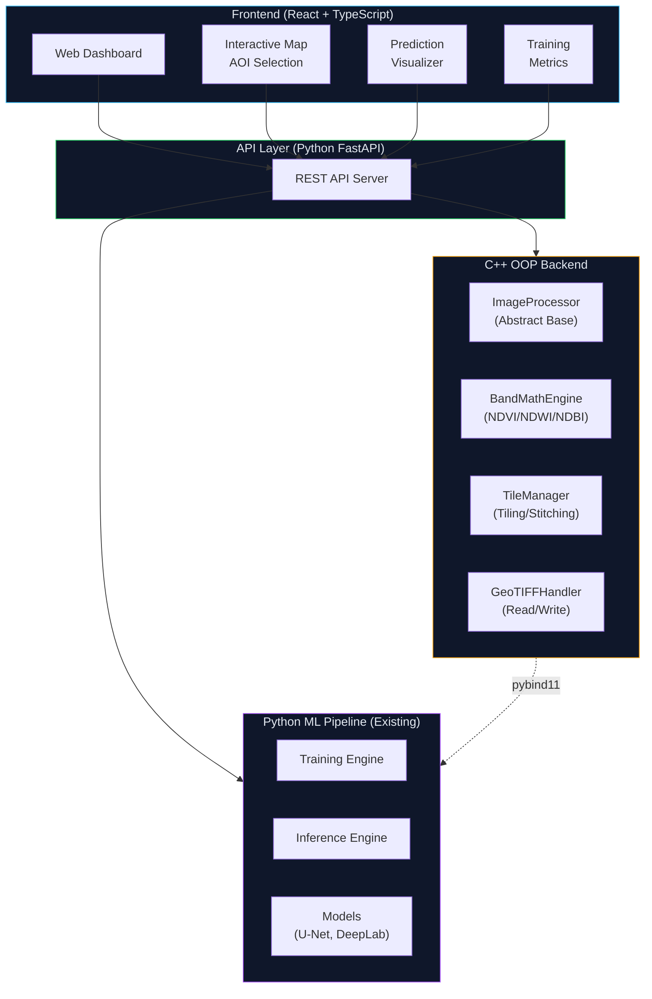
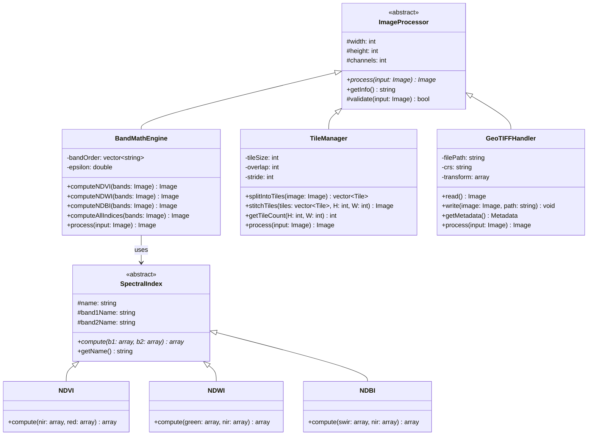
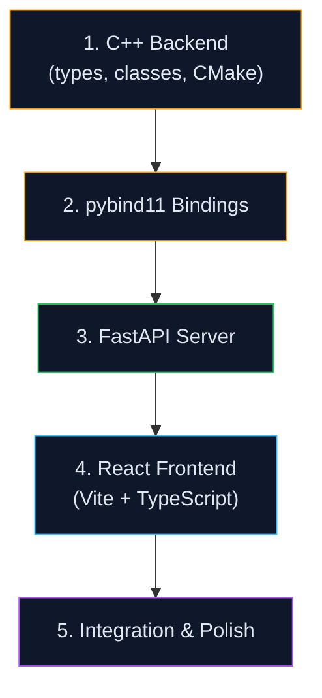

# 🛰️ Satellite Land Cover Segmentation — Expanded Plan

> Adding a **React + TypeScript frontend** and **C++ OOP backend** to the existing Python ML pipeline.

---

## Architecture Overview



---

## Expanded Project Structure

```
d:\COODING\Projects\Project Exibition\
│
├── frontend/                          # React + TypeScript Dashboard
│   ├── public/
│   │   └── index.html
│   ├── src/
│   │   ├── components/
│   │   │   ├── Layout/
│   │   │   │   ├── Navbar.tsx
│   │   │   │   ├── Sidebar.tsx
│   │   │   │   └── Footer.tsx
│   │   │   ├── Map/
│   │   │   │   ├── AOIMap.tsx             # Leaflet interactive map for AOI selection
│   │   │   │   └── MapControls.tsx
│   │   │   ├── Visualization/
│   │   │   │   ├── PredictionViewer.tsx   # Side-by-side GT vs prediction
│   │   │   │   ├── SpectralIndices.tsx    # NDVI/NDWI/NDBI heatmaps
│   │   │   │   ├── ClassLegend.tsx        # Color-coded class legend
│   │   │   │   └── ImageOverlay.tsx       # Semi-transparent mask overlay
│   │   │   ├── Dashboard/
│   │   │   │   ├── TrainingProgress.tsx   # Loss curves, metrics (Chart.js)
│   │   │   │   ├── MetricsCard.tsx        # IoU, accuracy cards
│   │   │   │   └── PhaseTracker.tsx       # Phase 1→4 progress
│   │   │   ├── Upload/
│   │   │   │   ├── FileUpload.tsx         # GeoTIFF drag & drop
│   │   │   │   └── UploadProgress.tsx
│   │   │   └── common/
│   │   │       ├── Button.tsx
│   │   │       ├── Card.tsx
│   │   │       ├── Modal.tsx
│   │   │       └── Loading.tsx
│   │   ├── pages/
│   │   │   ├── Home.tsx                   # Dashboard overview
│   │   │   ├── Training.tsx               # Training metrics & controls
│   │   │   ├── Inference.tsx              # Upload → predict → visualize
│   │   │   ├── MapView.tsx                # AOI selection page
│   │   │   └── Results.tsx                # Browse past predictions
│   │   ├── hooks/
│   │   │   ├── useTrainingStatus.ts       # Poll training progress
│   │   │   ├── useInference.ts            # Trigger & track inference
│   │   │   └── useMap.ts                  # Map interaction state
│   │   ├── services/
│   │   │   ├── api.ts                     # Axios API client
│   │   │   ├── trainingApi.ts             # Training endpoints
│   │   │   └── inferenceApi.ts            # Inference endpoints
│   │   ├── types/
│   │   │   ├── training.ts                # TrainingConfig, Metrics, etc.
│   │   │   ├── inference.ts               # InferenceRequest, Result, etc.
│   │   │   └── map.ts                     # AOI, Region, BoundingBox
│   │   ├── styles/
│   │   │   ├── globals.css                # Global styles, CSS variables
│   │   │   ├── components.css             # Component-specific styles
│   │   │   └── dashboard.css              # Dashboard layout
│   │   ├── App.tsx                        # Root component with routing
│   │   ├── main.tsx                       # Entry point
│   │   └── vite-env.d.ts
│   ├── package.json
│   ├── tsconfig.json
│   └── vite.config.ts
│
├── backend/                           # C++ OOP Image Processing
│   ├── include/
│   │   ├── image_processor.hpp        # Abstract base class
│   │   ├── band_math.hpp              # BandMathEngine (derived)
│   │   ├── tile_manager.hpp           # TileManager class
│   │   ├── geotiff_handler.hpp        # GeoTIFF I/O
│   │   ├── spectral_index.hpp         # SpectralIndex hierarchy
│   │   └── types.hpp                  # Shared types (Pixel, Tile, BBox)
│   ├── src/
│   │   ├── image_processor.cpp
│   │   ├── band_math.cpp
│   │   ├── tile_manager.cpp
│   │   ├── geotiff_handler.cpp
│   │   └── spectral_index.cpp
│   ├── bindings/
│   │   └── pybind_module.cpp          # pybind11 Python bindings
│   ├── tests/
│   │   └── test_band_math.cpp         # Unit tests
│   ├── CMakeLists.txt
│   └── main.cpp                       # Standalone CLI tool
│
├── api/                               # Python FastAPI Server
│   ├── __init__.py
│   ├── server.py                      # Main FastAPI app
│   ├── routes/
│   │   ├── __init__.py
│   │   ├── training.py                # Training start/stop/status
│   │   ├── inference.py               # Upload, predict, download
│   │   └── results.py                 # Browse past results
│   └── schemas.py                     # Pydantic models
│
├── src/                               # Existing Python ML Pipeline (unchanged)
├── configs/
├── scripts/
├── data/
└── outputs/
```

---

## Part A — C++ OOP Backend

> **Goal**: Implement performance-critical image processing with clean OOP design demonstrating **inheritance**, **encapsulation**, **polymorphism**, and **abstraction**.

### Class Hierarchy



### OOP Concepts Demonstrated

| Concept | Where |
|---------|-------|
| **Abstraction** | `ImageProcessor` abstract base class with pure virtual `process()` |
| **Encapsulation** | Private data members (`bandOrder`, `tileSize`), public interface methods |
| **Inheritance** | `BandMathEngine`, `TileManager`, `GeoTIFFHandler` inherit from `ImageProcessor` |
| **Polymorphism** | `SpectralIndex` hierarchy — NDVI/NDWI/NDBI implement same `compute()` interface |
| **Templates** | `Image<T>` template for different pixel types (uint16, float32) |
| **RAII** | `GeoTIFFHandler` manages file handles via constructor/destructor |
| **Operator Overloading** | `Image` class supports `+`, `-`, `/` for band math operations |

### File Specifications

#### [NEW] `backend/include/types.hpp`
- `Image<T>` template class — 3D array (channels × height × width)
- `Tile` struct — image patch + position metadata (x, y, w, h)
- `BoundingBox` struct — geographic bounding box
- `Metadata` struct — CRS, transform, band names
- Operator overloading on `Image` for element-wise arithmetic

#### [NEW] `backend/include/image_processor.hpp`
- Abstract base class with pure virtual `process()` method
- Protected `validate()` for input checking
- Virtual destructor for proper cleanup

#### [NEW] `backend/include/spectral_index.hpp` + `backend/src/spectral_index.cpp`
- `SpectralIndex` abstract base — normalized difference formula
- `NDVI`, `NDWI`, `NDBI` concrete classes
- Each overrides `compute(band1, band2)` → normalized difference result
- Factory function `createIndex(name)` → polymorphic creation

#### [NEW] `backend/include/band_math.hpp` + `backend/src/band_math.cpp`
- `BandMathEngine` — inherits `ImageProcessor`
- Encapsulates band ordering logic to prevent silent mismatches
- Uses `SpectralIndex` objects polymorphically
- `computeAllIndices()` → returns 3-channel image (NDVI, NDWI, NDBI)

#### [NEW] `backend/include/tile_manager.hpp` + `backend/src/tile_manager.cpp`
- `TileManager` — inherits `ImageProcessor`
- `splitIntoTiles()` — sliding window with overlap
- `stitchTiles()` — reassemble predictions into full image
- Edge tile padding/unpadding logic

#### [NEW] `backend/include/geotiff_handler.hpp` + `backend/src/geotiff_handler.cpp`
- `GeoTIFFHandler` — RAII file handle management
- Read/write GeoTIFF via GDAL C++ API
- Preserves CRS and geotransform on write
- Metadata extraction (dimensions, bands, projection)

#### [NEW] `backend/bindings/pybind_module.cpp`
- Exposes C++ classes to Python via pybind11
- `import geoseg_cpp` from Python
- Enables calling C++ band math and tiling from Python pipeline

#### [NEW] `backend/CMakeLists.txt`
- Build system for C++ library + Python bindings
- Links GDAL, pybind11
- Produces shared library (`.so`/`.dll`)

#### [NEW] `backend/main.cpp`
- Standalone CLI demonstrating all OOP classes
- Reads a GeoTIFF, computes indices, tiles, and writes output

---

## Part B — React + TypeScript Frontend

> **Goal**: Interactive web dashboard for visualizing segmentation results, selecting AOIs on a map, and monitoring training progress.

### Pages & Components

| Page | Key Components | What it does |
|------|---------------|--------------|
| **Home** | `PhaseTracker`, `MetricsCard` | Dashboard overview — phase progress, latest metrics |
| **Training** | `TrainingProgress` (Chart.js) | Live loss curves, IoU metrics, per-class breakdown |
| **Inference** | `FileUpload`, `PredictionViewer` | Upload GeoTIFF → run prediction → view results |
| **Map View** | `AOIMap` (Leaflet) | Draw bounding box on map → trigger GEE export |
| **Results** | `ImageOverlay`, `ClassLegend` | Browse & compare past predictions |

### Tech Stack

| Layer | Technology |
|-------|-----------|
| Framework | React 18 + TypeScript |
| Build | Vite |
| Routing | React Router v6 |
| Charts | Chart.js + react-chartjs-2 |
| Maps | Leaflet + react-leaflet |
| HTTP | Axios |
| Styling | Vanilla CSS with CSS custom properties (dark theme) |
| Icons | Lucide React |

### Key TypeScript Types

```typescript
// types/training.ts
interface TrainingConfig {
  phase: 1 | 2 | 3 | 4;
  dataset: string;
  model: string;
  epochs: number;
  lr: number;
  loss: string;
}

interface TrainingMetrics {
  epoch: number;
  trainLoss: number;
  valMetric: number;
  metricName: 'accuracy' | 'mIoU';
  perClassIoU?: Record<string, number>;
  lr: number;
}

// types/inference.ts
interface InferenceRequest {
  inputPath: string;
  modelCheckpoint: string;
  tileSize: number;
  overlap: number;
  useIndices: boolean;
}

interface InferenceResult {
  outputPath: string;
  classDistribution: Record<string, number>;
  previewUrl: string;
  timestamp: string;
}
```

---

## Part C — FastAPI Server (Glue Layer)

> Connects frontend to both Python ML pipeline and C++ backend.

### API Endpoints

| Method | Endpoint | Purpose |
|--------|----------|---------|
| `POST` | `/api/training/start` | Start training with config |
| `GET` | `/api/training/status` | Get current training progress |
| `POST` | `/api/training/stop` | Stop training |
| `POST` | `/api/inference/predict` | Upload GeoTIFF → run inference |
| `GET` | `/api/inference/result/{id}` | Get prediction result |
| `GET` | `/api/results` | List all past results |
| `POST` | `/api/aoi/export` | Trigger GEE export |
| `GET` | `/api/health` | Health check |

---

## Build Order



1. **C++ Backend** — `types.hpp` → `image_processor.hpp` → `spectral_index` → `band_math` → `tile_manager` → `geotiff_handler` → `main.cpp` → `CMakeLists.txt`
2. **pybind11 Bindings** — Expose C++ to Python
3. **FastAPI Server** — REST API connecting everything
4. **React Frontend** — Vite scaffold → pages → components → styling
5. **Integration** — Wire frontend to API, test end-to-end

---

## Verification Plan

### C++ Backend
```bash
cd backend && mkdir build && cd build
cmake .. && make
./geoseg_cli --test    # Run standalone demo
```

### Python Bindings
```python
import geoseg_cpp
engine = geoseg_cpp.BandMathEngine(["B02","B03","B04","B08","B11"])
print(engine.getInfo())
```

### API Server
```bash
cd api && uvicorn server:app --reload --port 8000
# Test: curl http://localhost:8000/api/health
```

### Frontend
```bash
cd frontend && npm install && npm run dev
# Opens at http://localhost:5173
```
